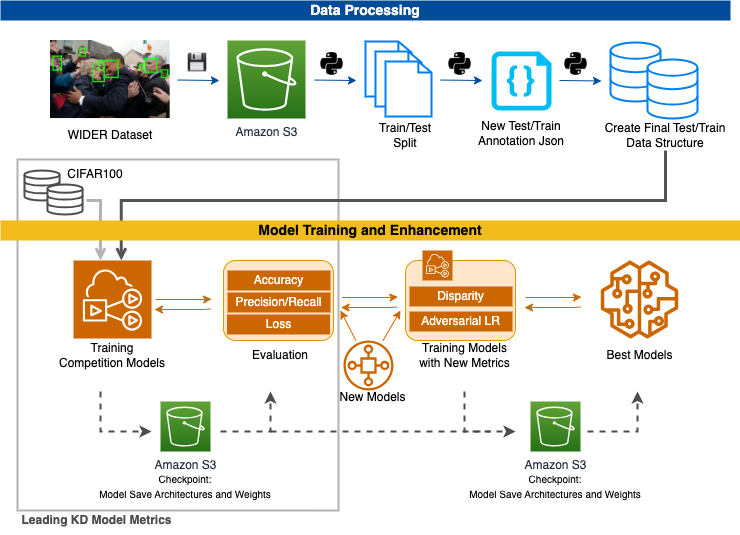

# Advancing Knowledge Distillation Models: An Evaluation of Current Models and Enhancement Through Adversarial Debiasing

## 0. Framework

### Problem and Motivation

AI models are accomplishing more exciting and complex tasks by the day. Yet, this performance boost comes at the cost of rapidly increased model sizes. We are living in a world where top models are comprised of billions of parameters, necessitating increasingly high compute and storage resources. This renders models inaccessible to many users, especially those on edge devices, which are resource-constrained by definition. 

The field of neural network compression has emerged to mitigate this, which is dedicated to shrinking the model size while maintaining accuracy. This enables models to run on resource-constrained devices, ultimately making them more accessible for users and researchers. It is of note to mention that by delivering models at lower computational and energy costs, we are also making machine learning more sustainable and cost-effective. Our research looks to a particular technique in neural network compression called knowledge distillation, which compresses a large performant model into a much smaller model and has been shown to be advantageous in terms of security and robustness against domain shift. Knowledge distillation employs a student-teacher framework, where a large, performant model acts as teacher and a smaller, predefined student model learns to mimic the outputs of the teacher. The resulting student model can then be deployed to an edge device as it demands drastically smaller compute and storage resources.

But what is not appropriately addressed in knowledge distillation literature is that they are inadvertently passing on bias as well, which is a side effect of this technique. So while a teacher model can learn a task very well, it can also learn stereotypes. As the student learns from the teacher, these stereotypes can be passed down and even exaggerated. This research aims to mitigate the bias inflation in student networks. The authors aim first: to establish comprehensive evaluation metrics, to include bias, for top performing knowledge distillation frameworks, and second: to integrate debiasing into the knowledge distillation framework for image classification.

### Proposed Framework

This research introduces a framework that combines knowledge distillation and adversarial learning for model compression and debiasing. Its main goal is to develop an efficient and unbiased student model, which learns from a complex teacher model while reducing biases in the training data, particularly those related to gender. The study demonstrates that adversarial debiasing can diminish bias and enhance accuracy by adjusting predictions to better represent underrepresented attributes within a class. This approach not only improves model efficiency and performance, but also addresses fairness concerns, making it a valuable contribution to the field of machine learning, especially in applications where resource limitations and ethical considerations are critical.



## 1 Set Up Notes
### 1.1 Set environment variables
- Ensure that you have set up a .env file containing your aws credentials. Create the `.env` file in src/ with the following structure
  
    ```bash
    AWS_ACCESS_KEY= <insert key>
    AWS_SECRET_KEY= <insert key>
    ```
    
### 1.2 Pull WIDER dataset
- Run the get_wider.py file to get the WIDER dataset from the s3 bucket.
    ```bash
    python3 src/get_wider.py 

    ```

### 1.3 Prepare class-means for Norm and Direction CIFAR
- Download the teacher checkpoint `cifar_teachers.tar` at <https://github.com/megvii-research/mdistiller/releases/tag/checkpoints> and untar it to `.src/CIFAR/ckpt`.
- Compute the class-mean of teachers on training set
  ```bash
  python3 src/CIFAR/emb_fea_distribution.py \
        --model_name resnet56_cifar \
        --model_weights 'MODEL WEIGHT PATH' \
        --emb_size 64 \
        --dataset 'cifar100' \
        --batch_size 128
  ```

## 2 Run KD Frameworks for CIFAR comparison

### 2.1 train student via CKD 
  ```bash
  python3 src/CIFAR/run_ckd.py \
        --epoch 240 \
        --batch_size 64 \
        --lr 0.1 \
        --save_dir "./run/CIFAR100/CKD/res34-res18"
  ```

### 2.2 train student via RKD
  ```bash
  python3 src/CIFAR/run_rkd.py \
        --epoch 240 \
        --batch_size 64 \
        --lr 0.1 \
        --save_dir "./run/CIFAR100/RKD/res50-res18"
  ```


### 2.3 train student via CTKD
  ```bash
  python3 src/CIFAR/run_ckd.py \
        --epoch 240 \
        --batch_size 64 \
        --lr 0.1 \
        --save_dir "./run/CIFAR100/CTKD/res34-res18"
  ```

### 2.4 train student via KD++
  ```bash
  python3 src/CIFAR/run_norm_and_dir.py \
        --epoch 240 \
        --batch_size 64 \
        --lr 0.1 \
        --save_dir "./run/CIFAR100/KD++/res56-res20"
  ```
Please refer to [CIFAR](https://github.com/WangYZ1608/Knowledge-Distillation-via-ND/tree/main/CIFAR) for more details.


## 3 Run Disparity Pipeline for De-Biasing

### 3.1 CKD
  ```bash
  python3 src/disparity_on_ckd.py \
        --epoch 240 \
        --batch_size 64 \
        --lr 0.1 \
        --save_dir "./run/WIDER/CKD/"
  ```

### 3.2 RKD
  ```bash
  python3 src/disparity_on_rkd.py \
        --epoch 240 \
        --batch_size 64 \
        --lr 0.1 \
        --save_dir "./run/WIDER/RKD/"
  ```

### 3.3 CTKD
  ```bash
  python3 src/disparity_on_ctkd.py \
        --epoch 240 \
        --batch_size 64 \
        --lr 0.1 \
        --save_dir "./run/WIDER/RKD/"
  ```

### 3.4 KD++
  ```bash
  python3 src/disparity_on_normdir.py \
        --epoch 240 \
        --batch_size 64 \
        --lr 0.1 \
        --save_dir "./run/WIDER/KD++/"
  ```


